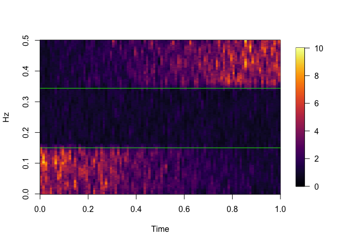

<!-- README.md is generated from README.Rmd. Please edit that file -->

# EFBA

<!-- badges: start -->

[](https://github.com/mattByrom-tamu/EFBA/actions/workflows/R-CMD-check.yaml)
<!-- badges: end -->

The R package “EFBA” provides functions for implementing empirical band
analysis for non stationary time series, with methods for functional and
multivariate cases. For reference, see the following.

1: \[“Empirical Frequency Band Analysis of Nonstationary Time Series.”
Bruce, Tang, Hall, Krafty (2020)\]
(<https://www.ncbi.nlm.nih.gov/pmc/articles/PMC8186526/>)

2: \[“Adaptive Frequency Band Analysis for Functional Time Series.”
Bagchi, Bruce (2021)\] (<https://arxiv.org/abs/2102.01784>)

3: \[“Frequency Band Analysis of Nonstationary Multivariate Time
Series.” Sundararajan, Bruce (2023)\]
(<https://arxiv.org/abs/2301.03664/>)

## Installation

You can install the development version of EFBA from
[GitHub](https://github.com/mattByrom-tamu/EFBA)

``` r
# install.packages("devtools")
devtools::install_github("mattByrom-tamu/EFBA")
# or
devtools::install_github("mattByrom-tamu/EFBA", build_vignettes=TRUE)
```

## Example

Empirical Band Analysis using the FRESH statistic for linear
time-varying dynamics (3 bands). Examples for a white noise (1 band) and
sinusoidal time-varying dynamics (3 bands) can be found in the EBA
vignette

``` r
library(EFBA)
library(fields)
#> Loading required package: spam
#> Spam version 2.10-0 (2023-10-23) is loaded.
#> Type 'help( Spam)' or 'demo( spam)' for a short introduction 
#> and overview of this package.
#> Help for individual functions is also obtained by adding the
#> suffix '.spam' to the function name, e.g. 'help( chol.spam)'.
#> 
#> Attaching package: 'spam'
#> The following objects are masked from 'package:base':
#> 
#>     backsolve, forwardsolve
#> Loading required package: viridisLite
#> 
#> Try help(fields) to get started.

###Simulate data for all simulated data settings described in paper
set.seed(823819); #if you change the seed, you will get different results
T <- 50000; #total length of time series 
X <- eba.simdata(T=T);

###Run search algorithm using FRESH statistic
##Input parameters
N <- 500; #number of observations per approximately stationary block
K <- 15; #number of tapers to use in multitaper spectral estimator
alpha <- 0.05; #significance level to use for testing partition points using FRESH statistic
std <- FALSE; #should the variance of each stationary block be set to one across all blocks? (TRUE or FALSE)

# Call the search algorithm using the FRESH statistic 
ebaout.bL <- eba.search(X=X$bL,N=N,K=K,std=std,alpha=alpha);

##See final partition of frequency space
ebaout.bL$part.final; #three bands estimated
#> [1] 0.000 0.150 0.344 0.500

ebaout.bL$log; #3 partition points tested in total, 2 determined to be significant
#>   bhat.idx  bhat   bhat.Q    bhat.pval bhat.pval.th bhat.sig
#> 1       76 0.150 61.32590 4.493191e-05 0.0008474576        1
#> 2      173 0.344 33.97128 2.157472e-05 0.0005102041        1
#> 3      235 0.468 76.96406 1.224938e-01 0.0010869565        0

image.plot(x=ebaout.bL$mtspec$t,y=ebaout.bL$mtspec$f,z=t(ebaout.bL$mtspec$mtspec), 
           axes = TRUE, col = inferno(256), zlim=c(0,10), 
           xlab='Time',ylab='Hz',xaxs="i"); 
abline(h=ebaout.bL$part.final[c(-1,-length(ebaout.bL$part.final))],col='green');
```



``` r

ebaout.bL$flat 
#>      partfinal pval.flat
#> [1,]     0.150 0.0000000
#> [2,]     0.344 0.7715428
#> [3,]     0.500 0.0000000
#p-value for band (0.150,0.344] fails to reject hypothesis of flat spectrum
#p-values for other frequency bands reject flat spectrum hypothesis
```
